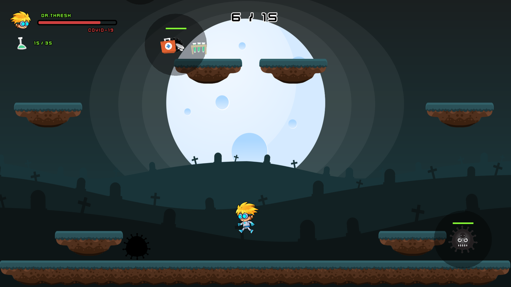

<div align="center">
  <h1>☣️ The Coronavirus War</h1>
  <p></p>
</div>


<div align="center">
  
</div>

<p></p>


<div align="center">
  📥 <a href="https://github.com/iivvaannxx/the-coronavirus-war/releases/tag/1.0.0">Download</a>
  <span>&nbsp;·&nbsp;</span>
  🔑 <a href="https://github.com/iivvaannxx/the-coronavirus-war?tab=License-1-ov-file">License</a>

  <p></p>
  <p><em><b>A 2D platformer game where scientists battle against COVID-19 viruses across multiple levels.</b></em></p>

  <p align="center">
    <a href="https://godotengine.org"></a>
    <a href="https://www.linux.org"></a>
    <a href="https://www.microsoft.com/en-us/windows"></a>
    
  </p>
</div>


> [!IMPORTANT]
> This repository is only a showcase of the game. It provides the links to download the game and information about it. The game is not open-source and the source code is not available, primarily due to the use of assets which license does not allow redistribution. The game is built using the Godot Engine and is available for Windows and Linux.

## 📖 Introduction

This is a game I created for a college subject during the COVID-19 pandemic. It's a 2D platformer where you play as a scientist battling against COVID-19 viruses across three different levels. As the player, you must exterminate all the viruses by throwing a super-powerful medicine developed by the scientists Thresh and Middle. But be careful! The viruses are very dangerous. If you get near them, you'll start to become infected, and if you get fully infected, you'll lose the game.

Are you ready to take on the challenge and save the world from these dangerous viruses?

## 🛠️ How to Play

The game is built for Windows and Linux (x86_64 architecture). Unfortunately, I don't own a Mac, so I can't provide a build for macOS 😢, if you want it I may be able to provide it to you, but because I can't test it, I can't guarantee it will work. You can download the game from the [releases page](https://github.com/iivvaannxx/the-coronavirus-war/releases/tag/1.0.0). Here's how to run them:

### Windows

1. Download the `TheCoronavirusWar_Windows.zip` file from the releases page.
2. Extract the contents of the zip file.
3. Run the `TheCoronavirusWar.exe` file.

### Linux
1. Download the `TheCoronavirusWar_Linux.zip` file from the releases page.
2. Extract the contents of the zip file.
3. Run the `TheCoronavirusWar` executable via the following commands:
```bash
# Ensure the file is executable.
chmod +x TheCoronavirusWar
./TheCoronavirusWar
```

## 🎮 Controls

The game doesn't have a pause menu. I don't recall why I didn't build one, but there isn't a way to pause the game 😬. If you press the `Escape` key, you will return directly to the main menu, so try not to press it accidentally! 

The game offers the possibility to play in two modes: one player and two players. For both modes there are 3 levels (the same). After selecting the mode on the main menu, you will be taken to the level selection screen. You can choose the level you want to play by clicking on the respective button. 

### Dr. Thresh and Dr. Middle

 - ***Dr. Thresh***: Is the one that must kill the viruses, because his medicine is the only one that can hurt them (has limited ammunition). 

 - ***Dr. Middle***: Acts as a support, he can freeze the viruses with his medicine (has infinite ammunition), but he can't kill them. He also has the special ability to activate a shield that protects him from getting infected (for a limited time).

If you're playing solo, you will be controlling only ***Dr. Thresh***, and all the movement keys of ***Dr. Middle*** will also be available to move him (the shield will not). Here are the controls for each doctor:

#### Dr. Thresh

- **Move Left**: `Left Arrow` + `A` (if playing solo)
- **Move Right**: `Right Arrow` + `D` (if playing solo)
- **Jump**: `Up Arrow` + `W` (if playing solo)
- **Throw Medicine**: `Space`

#### Dr. Middle

- **Move Left**: `A`
- **Move Right**: `D`
- **Jump**: `W`
- **Throw Freeze Medicine**: `Backspace`
- **Activate Shield**: `Z`

> [!CAUTION]
> If ***Dr. Thresh*** throws a medicine to ***Dr. Middle***, he will die instantly. If it's the other way around and ***Dr. Middle*** throws a freeze medicine to ***Dr. Thresh***, he will get stunned for a few seconds.

The goal of each level is to kill all the viruses. The UI of the game provides useful information about the game state (see screenshots below) like:

- The number of viruses left to kill and how many have been killed.
- The infection level of the player(s).
- The ammunition of ***Dr. Thresh***.
- How many shields ***Dr. Middle*** has left.

## 🤯 Known Bugs

There are some bugs I didn't have time to finish before the deadline of the project. I'll probably fix them some time in the future, but for now, they are there. Here are the known bugs:

- **Jumping on upward-moving platforms**: It just doesn't work, you will get stuck in the platform.
- **Player crushed by moving platforms**: If you get between a moving platform and a wall/ground, chances are the character will get stuck in between and you won't be able to control it until they separate.

## 📜 License

The Coronavirus War © 2022 by Ivan Porto Wigner is licensed under CC BY-NC-ND 4.0. To view the details of this license, visit [this link](https://creativecommons.org/licenses/by-nc-nd/4.0/legalcode.en).


## 📷 Screenshots





